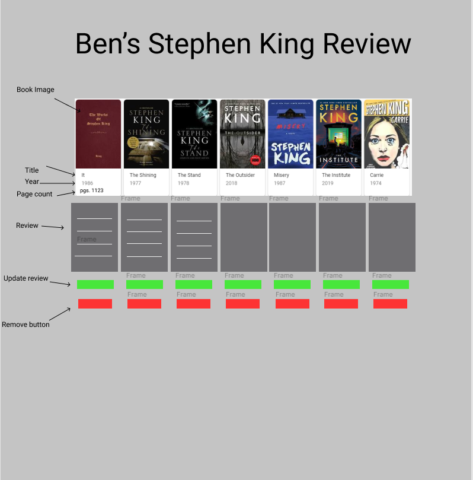
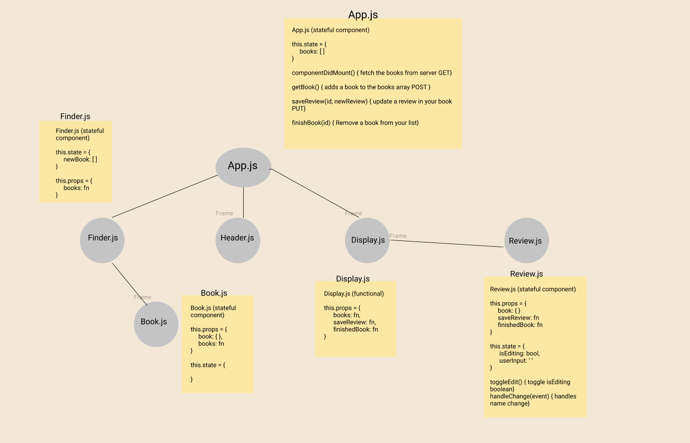

# Stephen King Library

## Aplication Concept and Wireframe
### Application Concept
- This is a application which displays popular books by Stephen King that I have read or want to read again.
- I will create my own personal file which will hold the data of the books
- Full CRUD
    - GET: get all the Stephen King books
    - POST: display Book information with image in my array and add a book to the array.
    - PUT: update a review on the book.
    - DELETE: Remove the book from my list once I have read it.

### Functionality
- I want a header at the top of the page to display the name of my applicaiton/site.
- When the app loads it will show the book image, title, year, page count, and review of all the books in my list.
- When the "Add Book" button is clicked it allows me to add a newBook to the list (adding: new image url, title, year, page count, along with a review of the newBook).
- Once I finish adding the book it will push it to my array.
- The list will now display that new book with its image, title, year, and page count
- The Books in the list will have a "Finished" button that allows me to remove it from the list.
-I can then update my review of a book.

### Endpoints
- GET - Books from my array of objects.
- POST - Push the newBook to the list and display it
- UPDATE - I can update the review for each book I read.
- DELETE - I can remove any book from my list that is being display.

### Component Architecture
- App.js (sateful component: This will hold the book information, this.state.books)
- Header.js (functional component: This will hold my header to the site)
- Finder.js (stateful component: this will get my book data that I have created 
in my file by using a axios request to get it.)
    - Book.js(stateful component: )
- DisplayBook.js (functional component: this will display my books)
    - Review.js (stateful component: this.state.review, this.state.editing)

### Wireframe/ Mockup  figma.com

